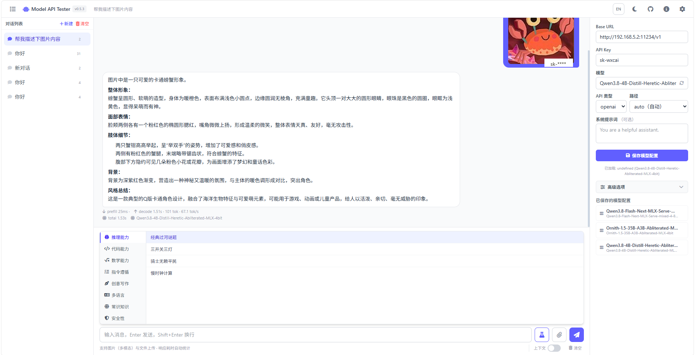

# ModelApiTester

English | [中文](./README.md)

A lightweight LLM API testing tool with multimodal chat, streaming output, response timing stats, and persistent conversations & model configs.

Designed for individuals/teams who need to test API availability and manage API keys — not a full-blown chat product, just "fill in the endpoint → send a message → see the result."



## Features

- **Multi-API types** — OpenAI / Anthropic / Google Gemini / other mainstream formats, auto-adapts request body and response parsing
- **Streaming output** — Supports OpenAI / Anthropic / Gemini SSE streaming formats, character-by-character output with Markdown render on completion
- **Response timing** — Each reply shows prefill time, decode time, generated token count, generation speed (tok/s), total elapsed time, and model name
- **Multimodal upload** — Multi-image select/preview (OpenAI vision format), file attachments (Claude document block), double-click to zoom images (Viewer.js)
- **Markdown + formulas** — markdown-it rendering + KaTeX math formulas (`$...$` inline / `$$...$$` block) + auto-play video links
- **Preset test prompts** — 32 curated prompts across 8 capability categories, one-click fill, ideal for comparing model capabilities
- **Persistent sessions & configs** — Multi-conversation management with SQLite storage; save/switch multiple model configs; auto-saves current config per message
- **Model list fetch** — Pull available models from `/v1/models` with live filtering
- **Context toggle** — One-click switch for sending conversation history (off = pure single-turn test mode)
- **i18n + dark/light theme** — Auto-detects browser/OS language; dark/light theme toggle

## Three Usage Modes

| Mode | Description | Use case |
|------|-------------|----------|
| **Server** | Rust binary + frontend static files, accessed via browser | Server deployment, team sharing |
| **Desktop app** | Tauri native desktop app, single portable binary | Local use, no server needed |
| **Build from source** | cargo + npm local build | Development, customization |

---

### Mode 1: Server

Download the files for your platform from [Releases](https://github.com/yachen4ever/ModelApiTester/releases):

| File | Platform |
|------|----------|
| `mat-server-linux-x64` | Linux x86_64 |
| `mat-server-windows-x64.exe` | Windows x86_64 |
| `mat-server-macos-arm64` | macOS Apple Silicon |
| `mat-server-macos-x64` | macOS Intel |
| `mat-frontend-dist.zip` | Frontend static files (all platforms) |

```bash
# 1. Create deployment directory
mkdir -p ~/mat-server/static
cd ~/mat-server

# 2. Place the binary
cp ~/Downloads/mat-server-linux-x64 ./mat-server
chmod +x mat-server

# 3. Extract frontend to static directory
unzip ~/Downloads/mat-frontend-dist.zip -d static/

# 4. Run
./mat-server --static-dir ./static
```

Open `http://localhost:52081` in your browser.

**CLI options:**

```
Usage: mat-server [OPTIONS]

Options:
      --host <HOST>          Listen address [default: 127.0.0.1]
      --port <PORT>          Listen port [default: 52081]
      --db-path <DB_PATH>    SQLite database path [default: ./model_api_tester.db]
      --static-dir <DIR>     Frontend static files directory [default: crates/http-server/static]
   -h, --help                 Show help
   -V, --version              Show version
```

All options are passed via CLI flags only; environment variables are not supported.

- `--static-dir`: Frontend static files directory. The backend has a built-in ServeDir to serve frontend pages directly. If using nginx to host the frontend, this option is not needed.
- `--db-path`: SQLite database location, useful for centralizing data management.

```bash
# Expose externally + custom port and data directory
./mat-server --host 0.0.0.0 --port 8080 --db-path /data/mat.db --static-dir /var/www/mat
```

**Production deployment (systemd + nginx):**

```ini
[Unit]
Description=Model API Tester
After=network.target

[Service]
Type=simple
WorkingDirectory=/opt/mat
ExecStart=/opt/mat/mat-server --host 127.0.0.1 --port 52081 --db-path /opt/mat/model_api_tester.db
Restart=always
RestartSec=3

[Install]
WantedBy=multi-user.target
```

nginx serves frontend static files directly and only proxies `/api/` to the Rust backend:

```nginx
# Frontend static files
location /mat/ {
    alias /var/www/mat/;
    index index.html;
    try_files $uri $uri/ /mat/index.html =404;
}

# API proxy to Rust backend
location /mat/api/ {
    proxy_pass http://127.0.0.1:52081/api/;
    proxy_set_header Host $host;
    proxy_set_header X-Real-IP $remote_addr;
    proxy_set_header X-Forwarded-For $proxy_add_x_forwarded_for;
    proxy_set_header X-Forwarded-Proto $scheme;
    proxy_http_version 1.1;
    proxy_set_header Upgrade $http_upgrade;
    proxy_set_header Connection "upgrade";
    proxy_buffering off;
    proxy_read_timeout 3600s;
    client_max_body_size 100m;
}
```

> In nginx mode, the backend does not need `--static-dir` (nginx handles static files), but `--db-path` is still required.

---

### Mode 2: Desktop App (Tauri)

Download the executable for your platform from [Releases](https://github.com/yachen4ever/ModelApiTester/releases) (**single file, no installer**):

| File | Platform |
|------|----------|
| `mat-desktop-windows-x64.exe` | Windows x86_64 |
| `mat-desktop-darwin-arm64` | macOS Apple Silicon |
| `mat-desktop-darwin-x64` | macOS Intel |
| `mat-desktop-linux-x64` | Linux x86_64 |

Download and launch directly — data is stored in `~/.mat-desktop/`, no server configuration needed.

---

### Mode 3: Build from Source

**Prerequisites:** Rust 1.75+, Node.js 18+

```bash
# 1. Build frontend
cd frontend
npm install
npm run build        # Output goes to crates/http-server/static/

# 2. Build backend
cd ..
cargo build --release

# 3. Run
./target/release/model-api-tester
```

**Local development** (start frontend and backend separately, with hot-reload):

```bash
# Terminal 1: Start backend (default 127.0.0.1:52081)
cargo run

# Terminal 2: Start frontend dev server (default localhost:5173, proxies /api -> :52081)
cd frontend
npm install
npm run dev
```

Open `http://localhost:5173` in your browser. Frontend code changes hot-reload instantly.

---

## Architecture

```
ModelApiTester/
├── crates/
│   ├── core/              # Shared business logic (server + desktop)
│   │   └── src/
│   │       ├── lib.rs     # Module exports + VERSION
│   │       ├── models.rs  # Data structures + DTOs
│   │       └── db.rs      # SQLite schema/migration/CRUD
│   ├── http-server/       # axum HTTP server
│   │   └── src/main.rs    # CLI args + routes + static file serving
│   └── tauri-app/         # Tauri desktop app (reuses core)
│       └── src/lib.rs     # IPC routing (api_request command)
├── frontend/              # Vite + Vue 3 frontend project
│   └── src/
│       ├── components/    # Vue components
│       │   ├── ChatPanel.vue       # Chat area + streaming + preset prompts
│       │   ├── ModelConfig.vue     # Model config panel
│       │   ├── MessageBubble.vue   # Message bubble + Markdown render
│       │   └── StreamBubble.vue    # Streaming output bubble
│       └── composables/   # Vue Composition utilities
│           ├── useApi.js           # API client
│           ├── useStream.js        # SSE streaming response parser
│           ├── useUtils.js         # Request builder + utilities
│           └── mdRender.js         # Markdown renderer (markdown-it + KaTeX + video)
└── .github/workflows/     # GitHub Actions CI/CD
```

**Tech stack:**

| Layer | Technology |
|-------|------------|
| Backend | Rust + axum + rusqlite + clap |
| Frontend | Vue 3 + Vite 6 + Tailwind CSS v4 + markdown-it + KaTeX |
| Desktop | Tauri 2 (reuses core + frontend) |

## API

| Method | Path | Description |
|--------|------|-------------|
| GET | `/api/health` | Health check |
| GET/POST | `/api/configs` | List / create model configs |
| PUT/DELETE | `/api/configs/:id` | Update / delete model config |
| GET/POST | `/api/conversations` | List / create conversations |
| PUT/DELETE | `/api/conversations/:id` | Update / delete conversation |
| GET/DELETE | `/api/conversations/:id/messages` | List / clear messages |
| POST | `/api/messages` | Save message (with images/files) |

## Changelog

See [CHANGELOG.md](./CHANGELOG.md).

## Credits

This project started as a fork of [openai-api-tester](https://github.com/RunningFelix/openai-api-tester) (MIT License), later rewritten as a Bun + SQLite version, and finally refactored to Rust + Vue 3.

## License

MIT